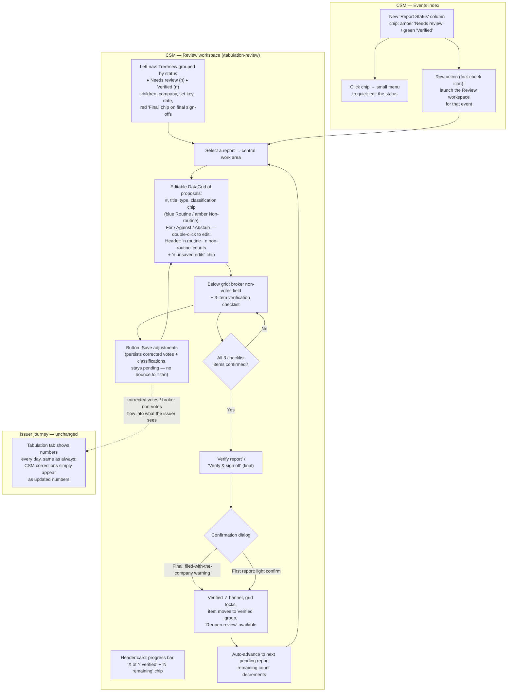

# CSM Tabulation Review Center — UX Workflow (Prototype)

Tabulation is a golden nugget of the business, so the first report of the 15-day window and the final report get an internal QC before they stand: reconfirm broker non-votes, confirm each proposal's routine / non-routine classification, and confirm votes are landing in the right categories (beneficial / registered, routine / non-routine). The final report is a business sign-off that gets filed with the company — legal exposure if wrong.

Two UX principles drive the design:

1. **Central work queue, not per-meeting gates.** The CSM works reports one at a time from a single screen, makes adjustments, saves, and always sees how many are remaining.
2. **Invisible to the client.** The issuer has been watching numbers for days; suddenly showing "waiting for approval" on day 15 raises questions ("what's being approved? why now?"). The review never blocks or labels anything on the client side.

## UX flow

## Who sees what

| Surface                | CSM                                                                                                                                                            | Issuer client                       |
| ---------------------- | -------------------------------------------------------------------------------------------------------------------------------------------------------------- | ----------------------------------- |
| Events page            | Set Key column/filter, **Report Status** chip column (click to quick-edit), fact-check row action to launch the workspace, **Tabulation Review** header button | Set Key column/filter; no review UI |
| `/tabulation-review`   | Full review workspace (tree nav + editable grid)                                                                                                               | "Restricted area" empty state       |
| Meeting Tabulation tab | Unchanged dashboard                                                                                                                                            | Unchanged dashboard — never gated   |

## Review workspace UI inventory

- **Events index additions (CSM + flag)** — `Report Status` chip column (amber "Needs review" / green "Verified"; click opens a two-option menu to quick-edit) and a fact-check icon row action that deep-links to `/tabulation-review?meeting={id}`.
- **Header card** — title, one-line purpose, progress bar, `N remaining` chip (turns green "All reports verified" at zero).
- **Left nav** (md 4/12) — `SimpleTreeView` with two status groups, _Needs review (n)_ and _Verified (n)_; children show company + ticker, set key · meeting date, and a red `Final` chip on final sign-offs.
- **Central work area** (md 8/12) — card per selected report:
  - Header: company — meeting title; date · set key · CUSIP; checkpoint chip.
  - _Editable DataGrid of proposals_: #, proposal, type, classification (blue `Routine` / amber `Non-routine` chip; single-select edit), For / Against / Abstain (numeric, double-click to edit), recommendation. Grid header shows `n routine · n non-routine` counts and an `n unsaved edits` chip. The CSM corrects numbers **in place** instead of sending the report back to the Titan team.
  - _Broker non-votes_: numeric field + helper text.
  - _Verification checklist_: broker non-votes correct · routine/non-routine correct · vote categories correct.
  - Actions: **Save adjustments** (outlined — persists corrected vote totals, classifications, broker non-votes; stays pending) · **Verify report / Verify & sign off** (contained, disabled until all three checks).
  - After verify: success banner "Verified by {name} on {time}", grid and fields locked, **Reopen review** text action.
- **Confirmation dialogs** — first report: light confirmation; final report: sign-off language ("filed with the company — confirm every number").

## Data & flag

- Flag `enable-csm-tabulation-approval` gates the workspace, the index column, and both entry actions.
- State per meeting in `meeting.tabulationReview`: `{ status: PENDING_REVIEW | VERIFIED, checkpoint, checklist{3}, proposalClassifications{proposalId → ROUTINE|NON_ROUTINE}, reviewedBy, reviewedAt, note }`. Broker non-vote adjustments write to `meeting.brokerNonVote`; corrected vote totals write to the proposal records via `PUT /proposals/{id}`.

## Simplifications / open questions

- Queue currently lists every active meeting; real rule is first-report (day 15) and final-report checkpoints per event — needs report-feed dates.
- Checkpoint is derived from days-to-meeting (≤2 days → final sign-off).
- Routine/non-routine lives in the review JSON, not on the proposal record.
- **Open question — can the CSM edit?** The mock assumes yes (recollection from the meeting: adjust directly rather than bounce to the Titan team), so vote totals and broker non-votes are editable in place. If that turns out to be wrong, the grid drops `editable` and the workflow needs a "Return to Titan" action instead.
- Should verified final reports generate the filed sign-off artifact (PDF)?
